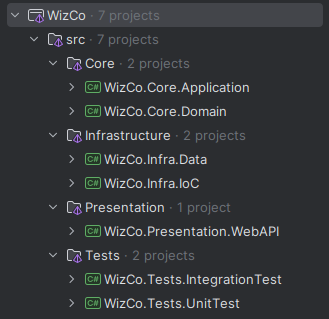
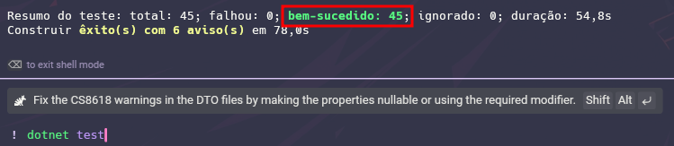
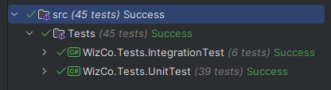
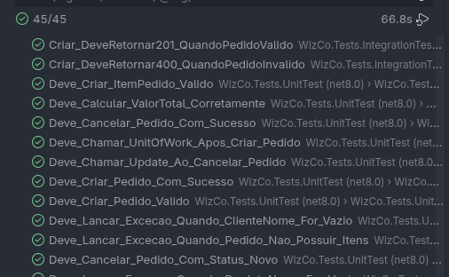
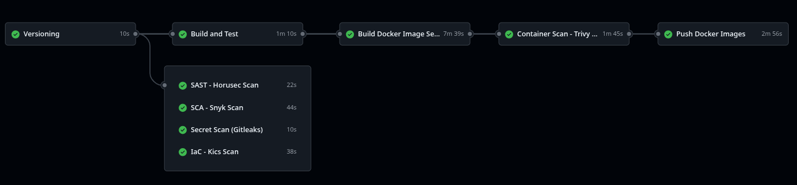
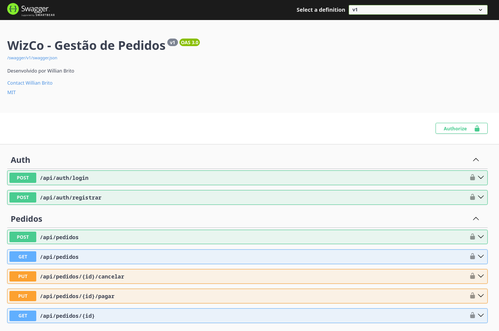
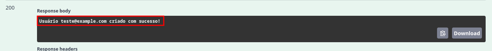
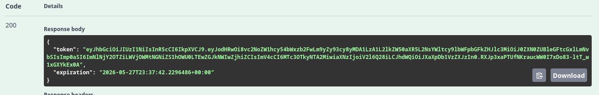
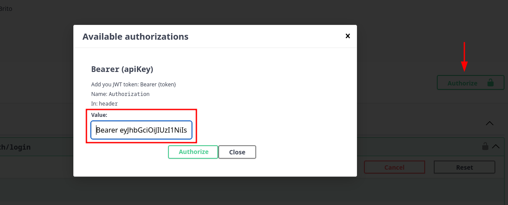

[](https://github.com/Willian-Brito/wiz-co-pedidos/actions/workflows/ci.yml)

# 🏦 Wiz Co - Teste para Desenvolvedor Backend .NET

Este repositório foi criado para realizar o teste de desenvolvedor backend .net da empresa Wiz Co

## 📚 Teste Teórico — Respostas

### 🧠 LÓGICA / ARQUITETURA
### 1. Você tem uma API lenta. Como investigaria o problema?
Primeiro eu tentaria identificar onde está o gargalo. Nem sempre o problema está na API em si, às vezes pode ser banco de dados, chamadas externas, excesso de processamento ou até infraestrutura.

Normalmente eu começaria analisando logs, métricas de tempo de resposta e consumo de recursos (CPU e memória). Depois verificaria queries lentas no banco, endpoints mais acessados e possíveis operações bloqueantes. Também gosto de utilizar ferramentas de tracing/APM para entender o fluxo completo da requisição.

Se necessário, faria testes de carga para reproduzir o problema e validar onde a aplicação começa a degradar.

### 2. Tenho um endpoint que é muito chamado. Ele não recebe parametros e retorna o mesmo resultado, mas a query no banco é pesada. Como melhorar isso?
Como o retorno é sempre o mesmo, não faz sentido consultar o banco toda vez. Dependendo da necessidade, poderia usar cache em memória para algo simples ou Redis para um ambiente distribuído.

Isso reduz bastante a carga no banco e melhora muito o tempo de resposta da API.

### 3. Como garantir que uma operação crítica não seja executada duas vezes?
Depende do contexto, mas normalmente eu utilizaria idempotência.

Por exemplo, em operações de pagamento, é comum trabalhar com identificadores únicos da operação para evitar duplicidade. Também podem ser utilizados locks, transações ou validações no banco para impedir registros duplicados.

### 4. Como você lidaria com concorrência em atualização de dados?
Eu utilizaria algum mecanismo de controle de concorrência.

O mais comum em APIs é optimistic concurrency, utilizando campos como RowVersion/Timestamp. Assim conseguimos detectar quando dois usuários tentam alterar o mesmo registro ao mesmo tempo.

Dependendo da criticidade, também é possível usar transações ou locks pessimistas.

### 5. O que você faria se um endpoint começar a receber 10x mais tráfego?
Primeiro eu avaliaria se a aplicação suporta escalar horizontalmente. Depois analisaria cache, otimização de queries, filas assíncronas e balanceamento de carga.

Também considero importante aplicar rate limit para evitar abuso e proteger a infraestrutura.

Se houver processamento pesado, mover parte do trabalho para background jobs pode ajudar bastante.

### 6. Tenho um endpoint dando erro de cors no Browser, mas funcionando pelo postman. Qual o motivo?
Porque o navegador aplica a política de CORS por segurança e o Postman não.

Nesse caso, provavelmente a API não está permitindo a origem do frontend nas configurações de CORS do ASP.NET Core.

### ⚙️ .NET / C#
### 1. Qual a diferença entre Task, ValueTask e async void? Quando usar cada um?
`Task` é o mais comum e deve ser utilizado na maioria das operações assíncronas.

`ValueTask` é mais voltado para cenários de alta performance, onde queremos evitar alocações desnecessárias de memória quando o retorno pode já estar disponível.

Já `async void` normalmente deve ser evitado, porque não permite tratamento adequado de exceções nem controle da execução. O uso mais comum dele é em eventos.

### 2. Explique Dependency Injection no .NET Core. O que são Transient, Scoped e Singleton?
Dependency Injection é uma forma de desacoplar as dependências da aplicação, deixando o código mais organizado, testável e fácil de manter.

Sobre os ciclos de vida:

- **Transient:** cria uma nova instância toda vez que for solicitada.
- **Scoped:** mantém uma instância por requisição HTTP.
- **Singleton:** cria apenas uma instância para toda a aplicação.

### 3. O que é Middleware no ASP.NET Core?
Middleware é um componente que participa do pipeline da requisição HTTP. 

Ele consegue interceptar requests e responses antes de chegarem ao endpoint. É muito utilizado para autenticação, logs, tratamento de exceções, rate limit, CORS e outras responsabilidades transversais.

No projeto, por exemplo, utilizei um middleware global para tratamento de exceções.

### 🗄️ DAPPER
### 1. Quando você escolheria Dapper em vez de EF Core?
Eu escolheria Dapper principalmente em cenários onde performance é prioridade ou quando preciso de queries SQL mais complexas e com controle fino.

EF Core é excelente para produtividade e manutenção, mas em consultas muito pesadas ou sistemas altamente performáticos o Dapper costuma entregar resultados melhores por ser mais leve.

### 2. Como evitar SQL Injection no Dapper?
Sempre utilizando parâmetros nas queries.

Nunca concatenando strings diretamente no SQL.

```csharp
connection.Query("SELECT * FROM Pedidos WHERE Id = @Id", new { Id = id });
```

Assim o próprio Dapper faz o tratamento seguro dos parâmetros.

### 🌐 REST API
### 1. Diferença entre PUT e PATCH.
`PUT` normalmente representa uma atualização completa do recurso.

Já `PATCH` é utilizado para atualizações parciais, alterando apenas alguns campos.

### 2. Como versionar uma API?
A forma mais comum é pela URL, algo como:

```bash
/api/v1/pedidos
```
Mas também é possível versionar por header ou query string.

Versionamento é importante para manter compatibilidade com clientes antigos sem quebrar integrações.

### 3. Cite códigos HTTP comuns e seus usos (200, 201, 400, 401, 403, 404, 500).

- **200:** requisição executada com sucesso.
- **201:** recurso criado com sucesso.
- **400:** erro na requisição enviada pelo cliente.
- **401:** usuário não autenticado.
- **403:** usuário autenticado, mas sem permissão.
- **404:** recurso não encontrado.
- **500:** erro interno da aplicação.

### ⛃ BANCO DE DADOS
### 1. Diferença entre INNER JOIN e LEFT JOIN.
O `INNER JOIN` retorna apenas registros que possuem relacionamento entre as tabelas.

Já o `LEFT JOIN` retorna todos os registros da tabela da esquerda, mesmo que não exista correspondência na outra tabela.

### 2. O que é índice? Quando pode piorar a performance?
Índice é uma estrutura utilizada para acelerar consultas no banco de dados.

Ele melhora bastante buscas e filtros, mas também tem custo. Em tabelas com muitas operações de escrita, índices em excesso podem prejudicar performance porque precisam ser atualizados constantemente.

### 3. Diferença entre banco relacional e não relacional.
Bancos relacionais trabalham muito bem com dados estruturados e relacionamentos fortes, normalmente utilizando SQL e propriedades ACID.

Já bancos não relacionais oferecem mais flexibilidade de estrutura e costumam ser escolhidos em cenários de grande escala, alta distribuição ou dados menos estruturados.

## </> Teste Prático de Código

### 🚀 WizCo - API de Gestão de Pedidos

Projeto desenvolvido como solução para o teste técnico da empresa WizCo, utilizando .NET 8, princípios modernos de arquitetura, boas práticas de engenharia de software, segurança e Pipelines CI/CD com práticas de DevSecOps para automação de garantia de qualidade.

### 📌 Sobre o Projeto

A aplicação consiste em uma API REST responsável pelo gerenciamento de pedidos, permitindo:

- Criar pedidos
- Consultar pedidos
- Filtrar pedidos por status
- Cancelar pedidos
- Pagar pedidos
- Autenticação via JWT
- Proteção contra abuso utilizando Rate Limit

### 🏗️ Arquitetura Utilizada

O projeto segue conceitos inspirados em:

- Clean Architecture
- Domain Driven Design (DDD)
- CQRS
- SOLID

#### 📁 Estrutura organizada em camadas:



### 🧠 Práticas de Engenharia de Software Aplicadas

#### 📌 CQRS Pattern

Separação entre operações de leitura e escrita da aplicação.

Isso deixou o projeto mais organizado, facilitando manutenção, testes e evolução futura da API.

#### 📌 Result Pattern

Utilizado para padronizar retornos da aplicação sem depender excessivamente de exceptions para regras de negócio.

Com isso, os endpoints ficaram mais previsíveis e fáceis de consumir.

#### 📌 Repository Pattern

Aplicado para desacoplar o acesso a dados da regra de negócio.

Essa abordagem facilita manutenção, testes unitários e futuras trocas de tecnologia de persistência.

#### 📌 Unit Of Work

Responsável por controlar transações e persistência de dados de forma centralizada.

Garantindo maior consistência durante operações críticas.

#### 📌 Global Exception Middleware

Middleware global criado para tratamento padronizado de exceções.

Evita exposição de erros internos e melhora a experiência de consumo da API.

#### 📌 DTOs + AutoMapper

Utilizados para desacoplar entidades de domínio da camada de apresentação.

Isso evita exposição indevida de dados e melhora a organização do projeto.

#### 📌 FluentValidation

Validações implementadas de forma centralizada e desacoplada das entidades.

Deixando o código mais limpo e fácil de manter.

#### 📌 Paginação

Implementação de paginação nos endpoints de listagem para melhorar performance e evitar retornos excessivos de dados.

#### 📌 Autenticação e Autorização JWT

Implementação de autenticação baseada em JWT para proteger os endpoints da aplicação.

Foi aplicado controle de acesso via token Bearer.

#### 📌 Rate Limit

Proteção contra abuso da API utilizando limitação de requisições.

Importante para aumentar resiliência e segurança da aplicação.

#### 📌 Testes Unitários

Foram criados testes para validação das principais regras de negócio, commands e handlers.

Garantindo maior confiabilidade da aplicação.

#### 📌 Testes de Integração

Testes realizados validando o comportamento real da API ponta a ponta.

#### 📌 Docker

Aplicação totalmente containerizada para facilitar execução, deploy e padronização de ambiente.

#### 📌 CI/CD

Pipeline automatizada utilizando **GitHub Actions**.

#### Automatizando:

- Build
- Testes
- Versionamento
- Build Docker
- Publicação de imagens

#### 📌 DevSecOps

Foram adicionadas ferramentas de análise de segurança na pipeline para aproximar o projeto de um ambiente corporativo real.

#### Ferramentas utilizadas:

- Horusec (SAST)
- OWASP Dependency Check (SCA)
- Gitleaks (Secret Scan)
- KICS (IaC Scan)
- Trivy (Container Scan)

#### 📌 Regras de Negócio Implementadas

- ✅ Pedido não pode ser criado sem itens
- ✅ Quantidade deve ser maior que zero
- ✅ Valor total calculado automaticamente
- ✅ Pedido pago não pode ser cancelado 

### 🌐 Endpoints

### 🔓 Autenticação

#### 🔹 Registrar usuário
```http
POST /api/auth/registrar
```

#### 🔹 Login
```http
POST /api/auth/login
```

### 📦 Pedidos

#### 🔹 Criar pedido
```http
POST /api/pedidos
```

#### 🔹 Buscar pedido por ID
```http
POST /api/pedidos/{id}
```

#### 🔹 Buscar pedidos por status
```http
POST /api/pedidos?status=Pago
```

#### 🔹 Cancelar pedido

```http
PUT /api/pedidos/{id}/cancelar
```

#### 🔹 Pagar pedido

```http
PUT /api/pedidos/{id}/pagar
```

### 🧰 Tecnologias Utilizadas
#### 🔸 Backend
- .NET 8
- ASP.NET Core
- Entity Framework Core
- SQLite
- MediatR
- AutoMapper
- FluentValidation
- ASP.NET Identity
- JWT Bearer

#### 🔸 Testes
- xUnit
- Moq
- FluentAssertions

#### 🔸 DevOps / DevSecOps
- Docker
- Docker Compose
- GitHub Actions
- Horusec
- Trivy
- Gitleaks
- KICS
- OWASP Dependency Check

### 🧪 Testes Automatizados
Este projeto utiliza testes unitários e testes de integração para garantir maior confiabilidade, qualidade e segurança na evolução das APIs.

#### ▶️ Como executar os testes

```bash
dotnet test
```

#### ⬛ Terminal


#### 🟫 Rider


#### 🟦 VS Code


### 🐳 Docker

#### Subir container
```bash
# Vá para raiz do projeto
docker compose up -d
```

#### 🌐 URLs da aplicação
- **Swagger:** http://localhost:5215/swagger/index.html


### 🔁 Pipeline CI/CD



#### A pipeline realiza automaticamente:
```bash
✅ Versionamento
✅ Build
✅ Restore
✅ Testes
✅ Análise SAST
✅ Análise SCA
✅ Secret Scan
✅ IaC Scan
✅ Build Docker
✅ Container Scan
✅ Push Docker Hub
```


## 🚀 Como Executar o Projeto

O projeto pode ser executado normalmente por qualquer IDE compatível com .NET 8, como:

- Visual Studio
- JetBrains Rider
- Visual Studio Code

Porém, a forma mais simples e rápida de subir toda a aplicação é utilizando Docker + Docker Compose, pois toda a infraestrutura necessária já será criada automaticamente 🚀

### ▶️ Executando a aplicação

#### Na raiz do projeto execute:
```bash
docker compose up --build
```

#### Esse comando irá:
- criar a imagem Docker da API
- subir o container automaticamente
- criar o banco SQLite
- aplicar automaticamente as migrations do Entity Framework Core
- popular o banco com os dados iniciais (seed)

### 🌐 URL de acesso

Após subir os containers, a API estará disponível em:
- **Swagger:** http://localhost:5215/swagger

### 🗄️ Banco de Dados

#### O projeto utiliza:
- SQLite
- Entity Framework Core

O banco de dados é criado automaticamente na primeira execução da aplicação, assim como todas as migrations necessárias.

Não é necessário executar comandos manuais de migration 🚀

### 🔐 Autenticação

A API utiliza autenticação JWT Bearer.

Antes de acessar os endpoints protegidos da API de pedidos, é necessário:

1. Registrar um usuário
1. Realizar login
1. Utilizar o token JWT retornado



#### 👤 1. Registrar usuário

#### Endpoint:
```json
POST /api/auth/registrar
{
  "email": "user@example.com",
  "senha": "123456789",
  "confirmarSenha": "123456789"
}
```

#### Resposta:


#### 🔑 2. Realizar login

#### Endpoint:
```json
POST /api/auth/login
{
  "email": "user@example.com",
  "senha": "123456789"
}
```

#### Resposta:


### ⏳ Expiração do Token

- O token JWT possui validade de: **2 horas**
- Após esse período será necessário realizar login novamente.

### 🛡️ 3. Autenticar no Swagger

#### Após realizar login:

1. Copie o token JWT retornado
1. Clique no botão Authorize no Swagger
1. Informe o token no formato: `Bearer SEU_TOKEN`
1. Clique em Authorize



Agora os endpoints protegidos estarão liberados para uso ✅